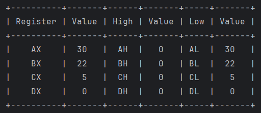

# Что за проект (RU)

Быть может самый тупой эмулятор ассемблера, который вы могли видеть. Он написан на яве. Реализованы следующие команды:

- MOV
- ADD
- SUB
- MUL
- DIV

Написан в качестве лабораторной работы для вуза

## Пример работы

Задание реализовать `Х = А - 5 (В - 2С) + 2`, при `A = 50`, `B = 10`, `C = 2`

```
mov bx, 10 ;B
mov ax, 2 ;C 
mov cx, 2
mul cx

sub bx, ax
mov ax, bx  
mov cx, 5
mul cx


mov bx, 50 ;A
sub bx, ax

add bx, 2
```

В `bx` наш результат 



# What kind of project (ENG)

Maybe the dumbest assembler emulator you've ever seen. It is written in Java. The following commands have been implemented:

- MOV
- ADD
- SUB
- MUL
- DIV

Written as a laboratory work for a university

## Example of the work

The task is to implement `X = A - 5 (B - 2C) + 2', with `A = 50`, `B = 10`, `C = 2`

```
mov bx, 10 ;B
mov ax, 2 ;C 
mov cx, 2
mul cx

sub bx, ax
mov ax, bx  
mov cx, 5
mul cx


mov bx, 50 ;A
sub bx, ax

add bx, 2
```

In `bx` our result is 


